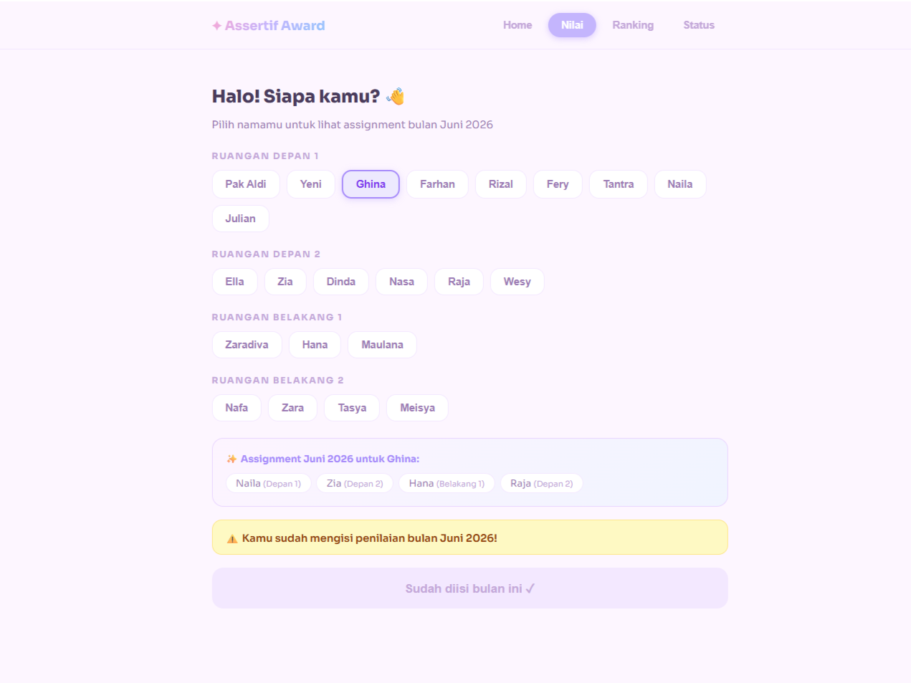
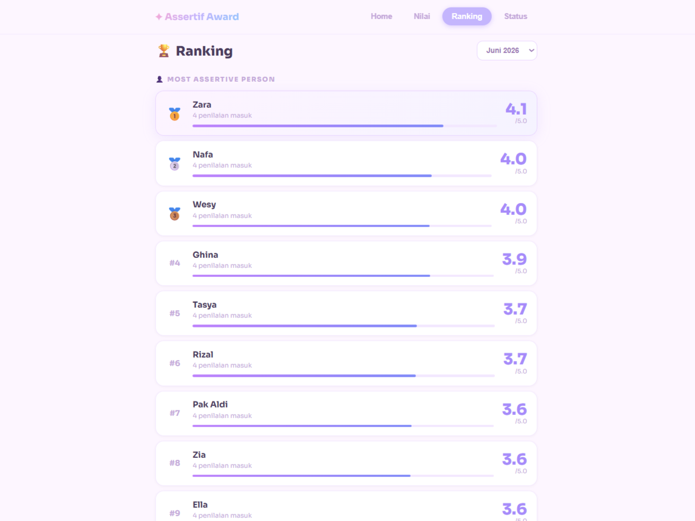
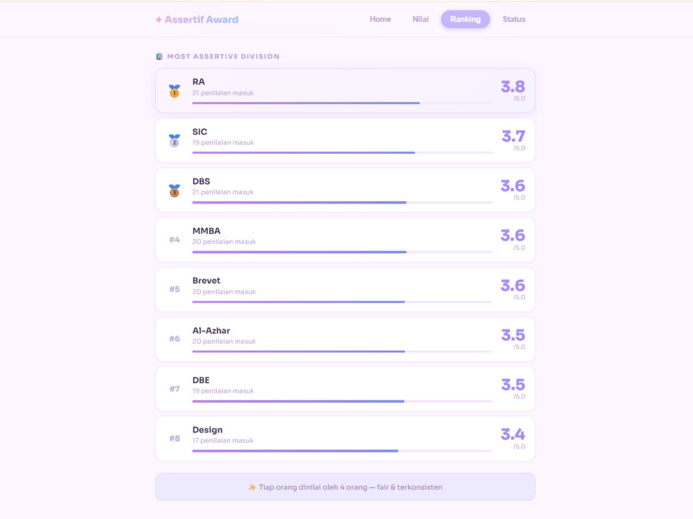
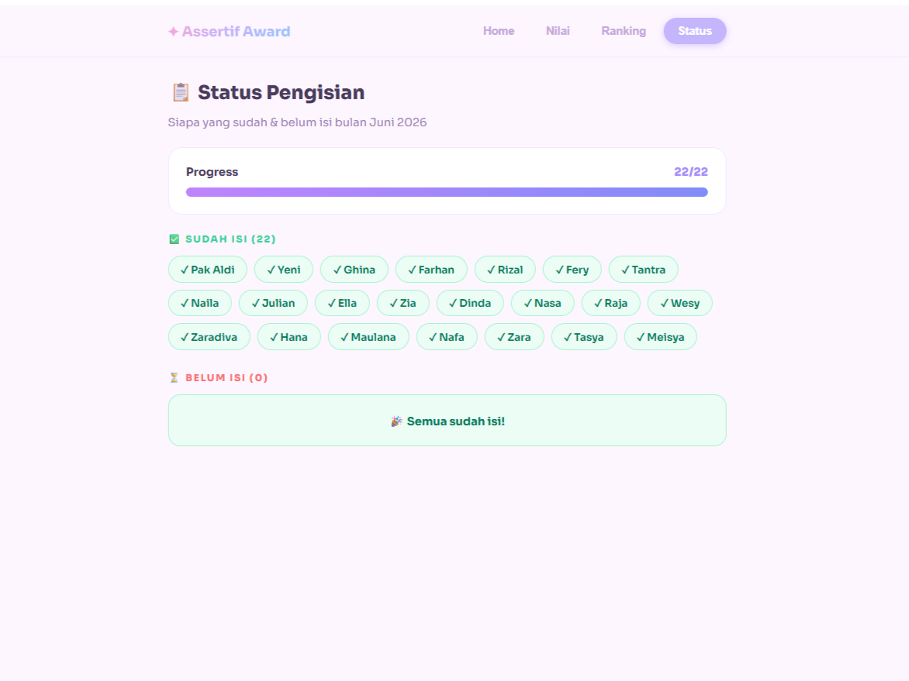
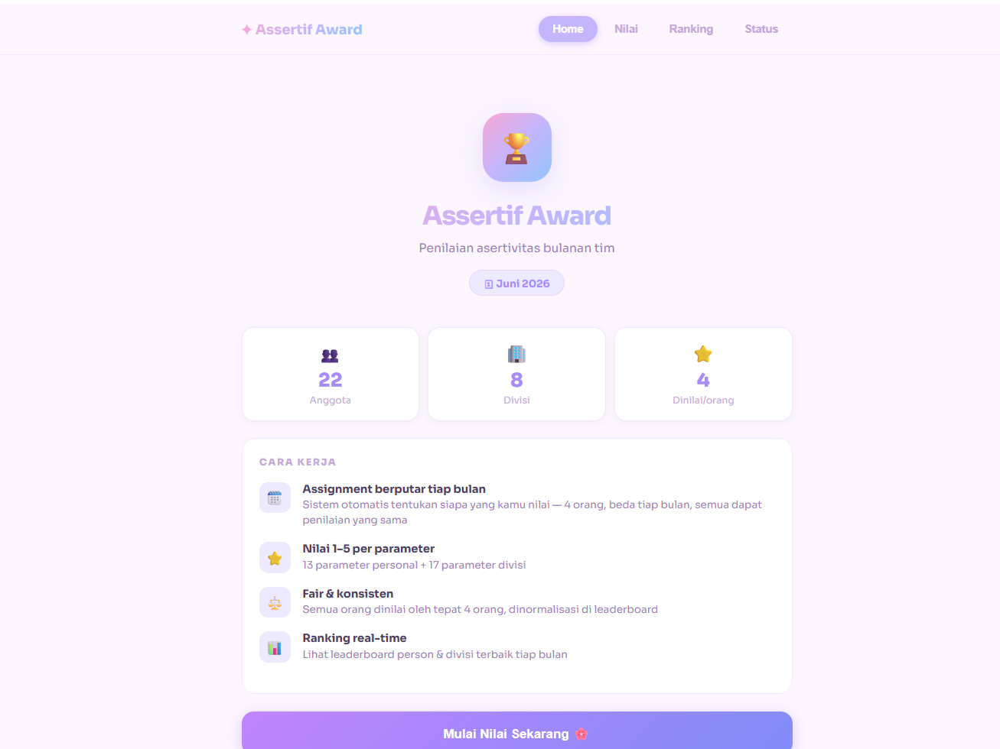

# 🏆 Assertive Award System


An internal web application that automates the company's monthly assertive behavior evaluation program by providing fair peer assignments, automatic score calculation, live rankings, and real-time submission monitoring.

> ⚠️ This project contains anonymized data and screenshots to protect confidential business information.

---

## 📌 Background

The company previously conducted an **"Assertive Behavior for Sustainability Improvement"** bootcamp to strengthen organizational culture.

One of the key outputs of the program was a monthly evaluation system that measured both individual and divisional assertive behaviors.

Initially, the evaluation was conducted using Google Forms. Over time, the process became increasingly difficult to sustain because employees had to evaluate too many colleagues, administrators calculated scores manually, and divisional evaluations gradually stopped running.

As participation declined, the organization's culture improvement initiative began losing momentum.

---

## 💡 Solution

I redesigned the entire evaluation workflow and developed a centralized web application to simplify the assessment process while maintaining fairness.

Instead of requiring employees to evaluate everyone, the system automatically assigns only four colleagues each month.

Every employee still receives four independent evaluations, ensuring balanced and representative results while dramatically reducing assessment workload.

The application also automates score calculation, generates live rankings, and enables administrators to monitor submission progress in real time.

---

## ✨ Key Features

### 👥 Smart Peer Assignment

- Automatic monthly peer assignment
- Each employee evaluates only four colleagues
- Every employee receives four independent evaluations
- Fair and balanced evaluation distribution

### 🏆 Live Rankings

- Individual assertiveness leaderboard
- Division assertiveness leaderboard
- Automatic score calculation
- Monthly ranking updates

### 📊 Submission Monitoring

- Real-time completion tracking
- Identify employees who have not submitted evaluations
- Progress monitoring for administrators

### 📋 Guided Evaluation Workflow

- Simple evaluation interface
- Personal and division assessments in one workflow
- Clear monthly evaluation process

---

## 👩‍💻 My Role

I independently led the project from concept to deployment.

My responsibilities included:

- Identifying why the previous evaluation system failed
- Redesigning the business process
- Designing the evaluation workflow
- Creating the peer assignment mechanism
- Designing the user experience
- Developing the frontend application
- Building the database using Supabase
- Deploying the application with Vercel
- Debugging production issues
- Maintaining and improving the system after launch

Although this project was outside my formal job responsibilities, I initiated and built it to help sustain the organization's culture improvement program.

---

## 🚀 Business Impact

The new system successfully revived the monthly assertive behavior evaluation program.

Key improvements include:

- Reduced employee workload by limiting evaluations to four colleagues
- Improved participation through a simpler evaluation process
- Eliminated manual score calculation
- Enabled division-level assessments to run consistently
- Simplified administrator monitoring with real-time submission tracking
- Supported long-term organizational culture improvement

---

## 💬 Early User Feedback

After launching the application, employees responded positively to the redesigned workflow.

One employee commented:

> "This is so much fun! Can I evaluate everyone instead?"

This feedback indicated that the new workflow felt significantly more engaging than the previous manual process.

---

## 🛠 Tech Stack

### Frontend

- React
- JavaScript
- HTML
- CSS

### Backend & Database

- Supabase

### Deployment

- Vercel

### Version Control

- GitHub

---

## 🏗 System Architecture

```text
Employees
        │
        ▼
Smart Peer Assignment Engine
        │
        ▼
Supabase Database
        │
        ▼
React Web Application
        │
        ├──────────────► Live Rankings
        ├──────────────► Submission Monitoring
        └──────────────► Management Dashboard
```

---

## 📷 Screenshots

### 🥇 Smart Peer Assignment

Automatically assigns four different colleagues to each employee every month, ensuring a fair and balanced evaluation process while significantly reducing assessment workload.



---

### 🥈 Live Ranking — Individual

Automatically generates monthly rankings based on peer evaluations, helping employees track their assertiveness performance.



---

### 🥈 Live Ranking — Division

Displays division-level rankings to encourage healthy competition and continuous organizational improvement.



---

### 🥉 Submission Monitoring

Administrators can monitor evaluation completion in real time and quickly identify employees who have not submitted their assessments.



---

### 🏅 Welcome Page

Landing page explaining how the evaluation process works before employees begin their monthly assessments.



---

## 🌐 Live Demo

https://assertif-award.vercel.app/

---

## 📈 Skills Demonstrated

- Operations Improvement
- Business Process Redesign
- Workflow Automation
- Full Stack Development
- Database Design
- UI/UX Design
- Project Ownership
- Problem Solving
- Process Optimization
- System Integration
